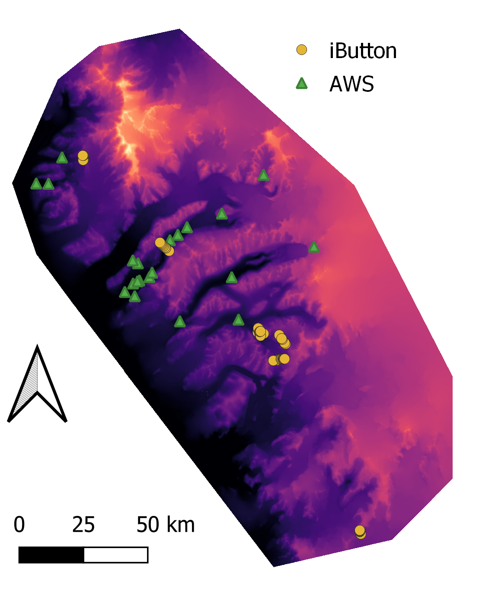
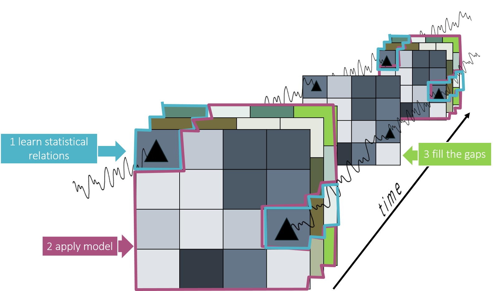

<!-- README.md is generated from README.Rmd. Please edit that file -->

```{r, include = FALSE}
knitr::opts_chunk$set(
  collapse = TRUE,
  comment = "#>"
)
```


# Surface Moisture for the Antarctic McMurdo Dry Valleys

<!-- badges: start -->
<!-- badges: end -->

This repository documents the worflow to produce high spatiotemporal resolution (30m, subdaily) surface moisture data for the Antarctic Dry Valleys. 

The script "data_overview_reproducible.Rmd" can be reproduced via Binder by klicking on the launch button, installing the required packages by running "install.R" and subsequently running the "data_overview_reproducible.Rmd" file. 
[](https://mybinder.org/v2/gh/MLezamaValdes/SurfaceMoistureMDV/master)

Supplementary material and data can also be found on [OSF](https://osf.io/2ktwg/).  

<!-- [](https://mybinder.org/v2/gh/MLezamaValdes/SurfaceMoistureMDV/master) -->

### Data

iButton and Automatic Weatherstation (AWS) data will be used to calibrate and validate a model with the help of spatially continuous predictors: 

{width=250}

{width=250}


### Methods 
First, statistical relations at the point data locations are being learned by a machine learning model (Fig. below 1), then the model is applied to the remaining spatial predictor space (Fig. below 2). Using the concept of the Area of Applicability developed by Meyer and Pebesma (2021), we make sure that the model is only applied to locations, where we can assume the model to have received sufficient information on the statistical relations. Finally (Fig. below 3) the gaps in time produced by the coarse temporal resolution of the spatially continous predictor data can be filled by spatio-temporal interpolation of the spatially continous surface moisture datasets created in step 2. 

{width=500}
