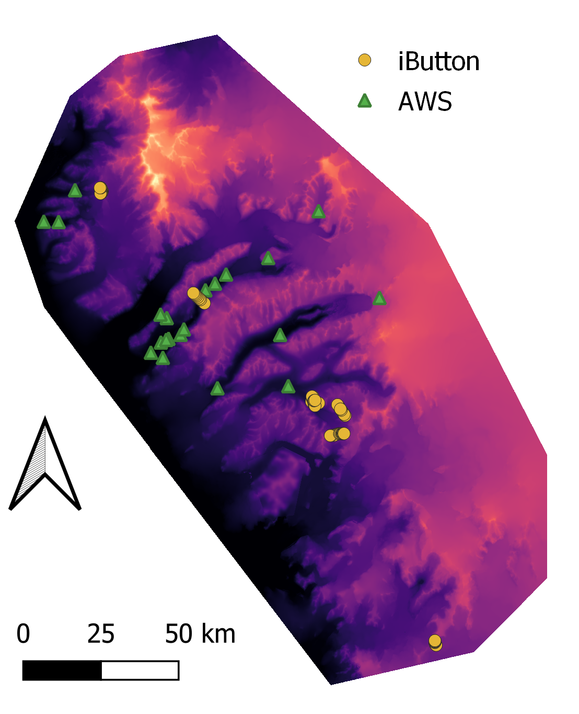

<!-- README.md is generated from README.Rmd. Please edit that file -->

# Surface Moisture for the Antarctic McMurdo Dry Valleys

<!-- badges: start -->

.. image:: <https://mybinder.org/badge_logo.svg> :target:
<https://mybinder.org/v2/gh/MLezamaValdes/SurfaceMoistureMDV/HEAD>
<!-- badges: end -->

This repository documents the worflow to produce high spatiotemporal
resolution (30m, subdaily) surface moisture data for the Antarctic Dry
Valleys.

### Data

iButton and Automatic Weatherstation (AWS) data will be used to
calibrate and validate a model with the help of spatially continuous
predictors:

<figure>
<figcaption aria-hidden="true">Calibration and Validation data</figcaption>
</figure>

<figure>
<figcaption aria-hidden="true">Spatial predictors</figcaption>
</figure>

### Methods

First, statistical relations at the point data locations are being
learned by a machine learning model (Fig. below 1), then the model is
applied to the remaining spatial predictor space (Fig. below 2). Using
the concept of the Area of Applicability developed by Meyer and Pebesma
(2021), we make sure that the model is only applied to locations, where
we can assume the model to have received sufficient information on the
statistical relations. Finally (Fig. below 3) the gaps in time produced
by the coarse temporal resolution of the spatially continous predictor
data can be filled by spatio-temporal interpolation of the spatially
continous surface moisture datasets created in step 2.

<figure>
<figcaption aria-hidden="true">Method</figcaption>
</figure>
