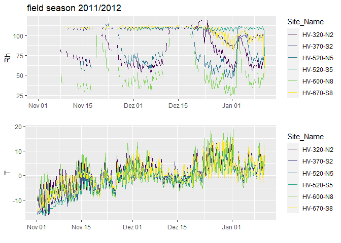
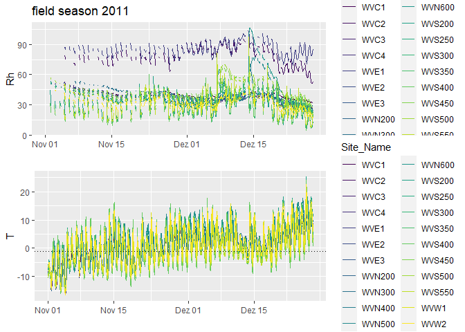
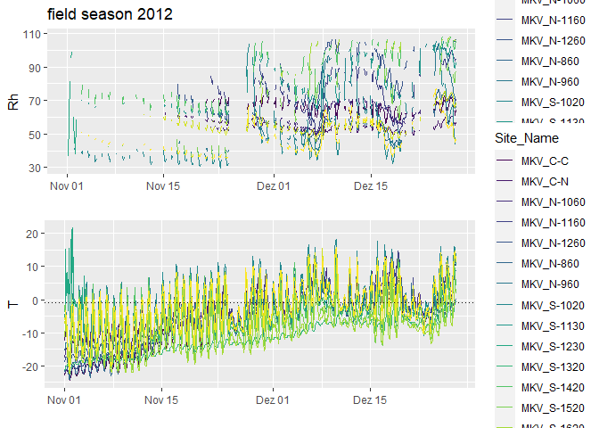
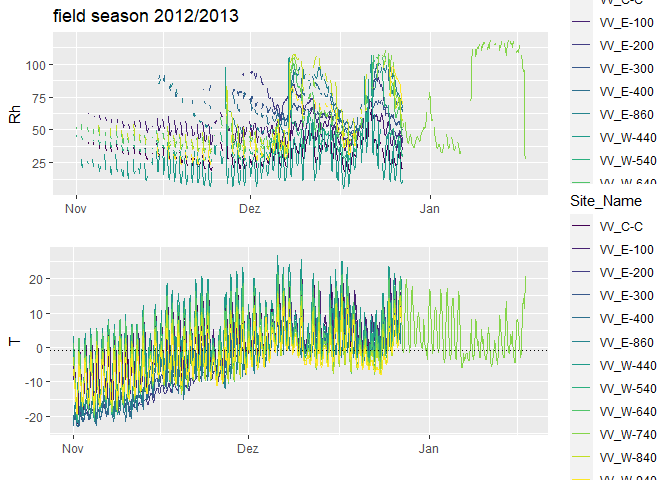
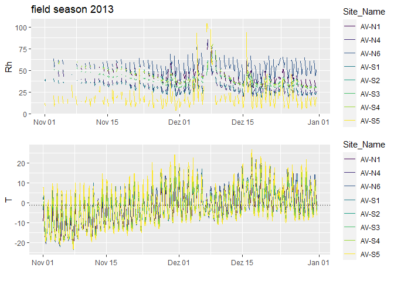
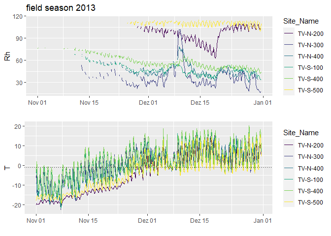
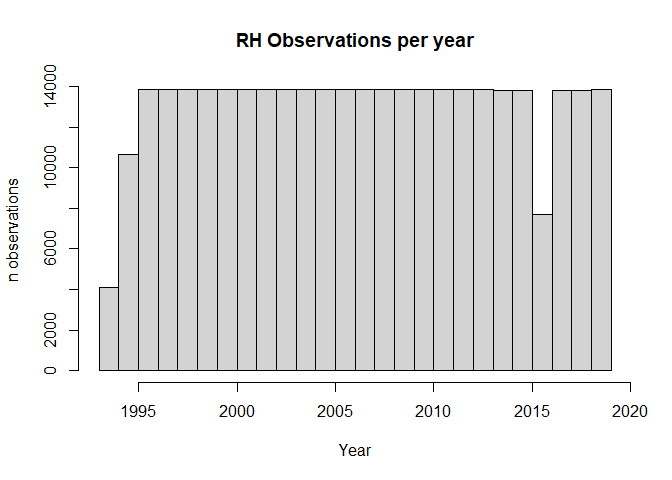
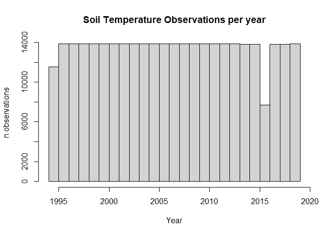
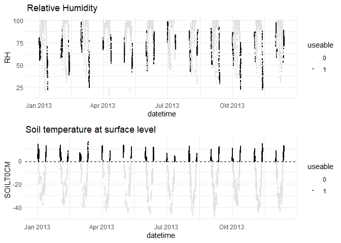

Calibration and validation data for surface moisture in the McMurdo Dry
Valleys
================
Maite
13 9 2021

This skript shows calibration and validation data for surface moisture
modelling in the McMurdo Dry Valleys in a descriptive way.

# iButton data

Read in iButton data for the different valleys.

Project iButton data to EPSG 3031

Use only data, where temperature is higher than -1°C

To see the iButton logger location names, hold cursor over point.

### Hidden\_Valley

<!-- -->

### Wright\_Valley

<!-- -->

### McKelvey\_Valley

<!-- -->

### Victoria\_Valley

<!-- -->

### Alatna\_Valley

<!-- -->

### Taylor\_Valley

<!-- -->

TV-S-500 seems to be below a snow patch in a shady corner and is fully
saturated.

# Automatic Weather Station Data

### Lake Fryxell Met Station

Dataset can be downloaded here: [Lake
Fryxell](https://mcm.lternet.edu/content/high-frequency-measurements-lake-fryxell-meteorological-station-frlm-mcmurdo-dry-valleys)

There are two datasets, one for relative humidity and one for soil
moisture, they are structured as follows:

    ##   ï..DATASET_CODE METLOCID        DATE_TIME    RH RH_COMMENTS
    ## 1         FRLM_RH     FRLM 12/07/1993 14:10 59.76            
    ## 2         FRLM_RH     FRLM 12/07/1993 14:20 59.53            
    ## 3         FRLM_RH     FRLM 12/07/1993 14:30 59.16

    ##   ï..DATASET_CODE METLOCID        DATE_TIME SOILT0CM SOILT5CM SOILT10CM
    ## 1      FRLM_SOILT     FRLM 11/30/1994 14:40    -1.35       NA        NA
    ## 2      FRLM_SOILT     FRLM 11/30/1994 15:00    -2.68       NA     -6.44
    ## 3      FRLM_SOILT     FRLM 11/30/1994 15:20    -2.82       NA     -6.57
    ##   SOILT_COMMENTS
    ## 1               
    ## 2               
    ## 3

Years that are covered in this dataset are:

Let’s for now take a look at the year 2013 and focus on Relative
Humidity and the soil temperature at surface level. We’re excluding
timestamps where surface soil temperature is below -1°C. When soil and
surface water freezes no reliable relative humidity information can be
measured any more.
<!-- -->
