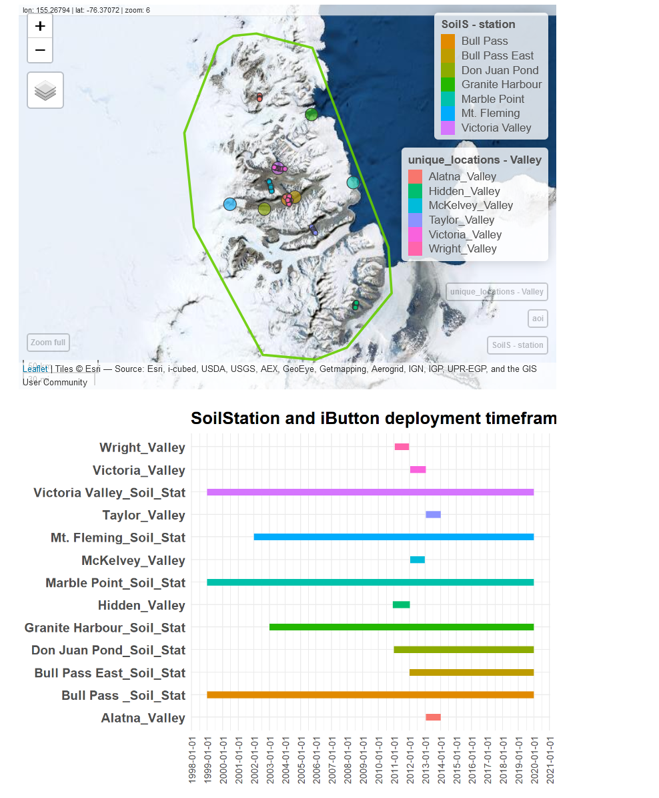
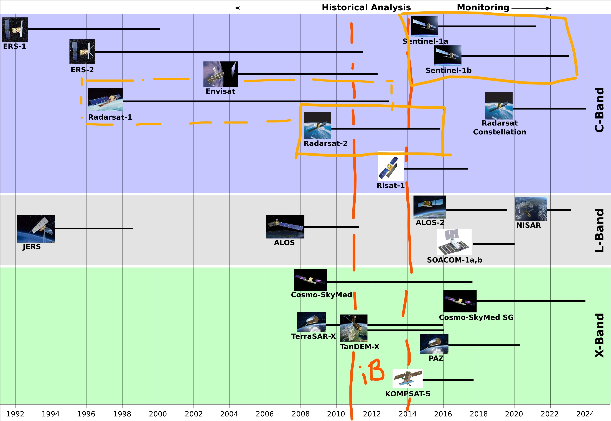
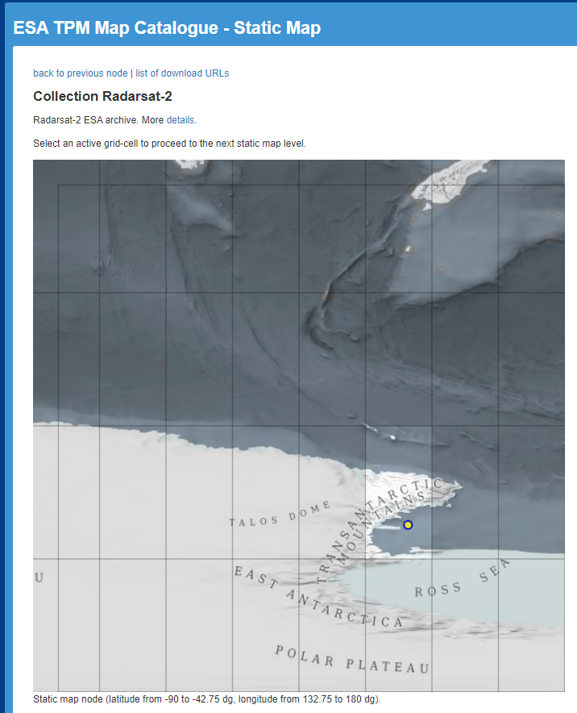
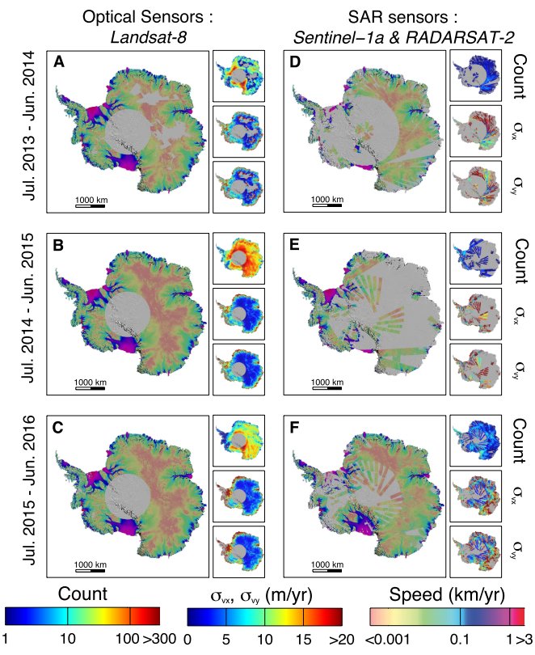
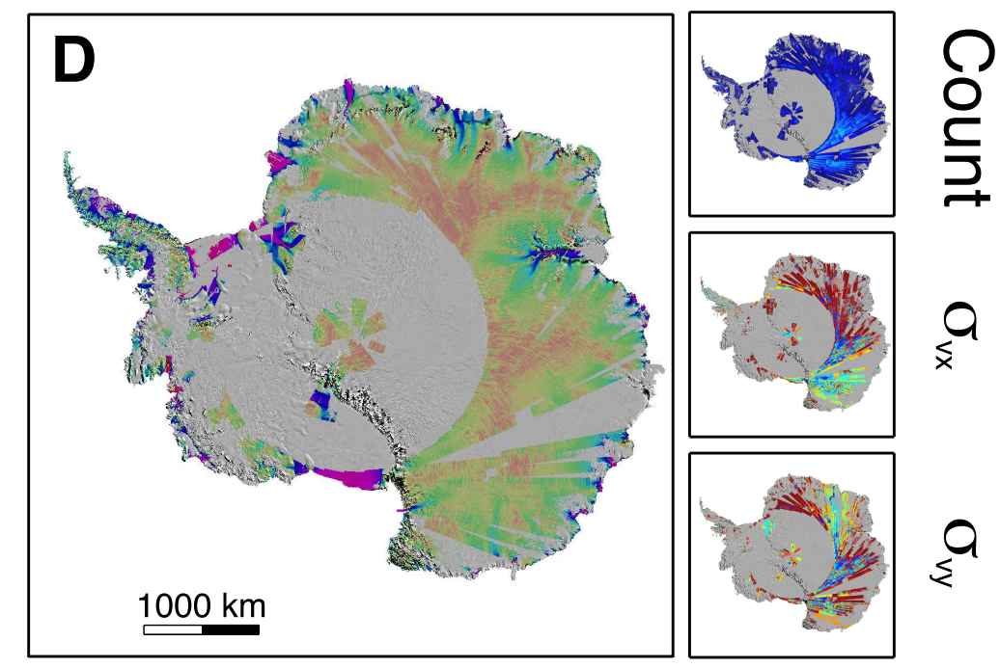
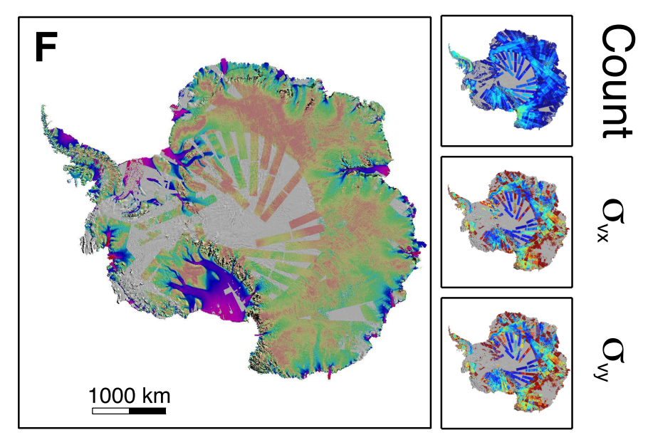

```{r setup, include=FALSE}
knitr::opts_chunk$set(echo = FALSE, message=F, warning = F)

# Colors: DarkMagenta, DarkCyan, DarkBlue, Teal, YellowGreen
```

```{r}
library(here)
library(raster)
```


# Work plan

0. write up some stuff I need to know about MDV surface moisture and its behaviour in this RMD as input to the paper 


1. **explore soil moisture dataset**
      * data cleaning necessary? 
      * understand surface moisture and temperature information distributions, determine cut-off value (0°C? -x°C?) 
      * spatial configuration of loggers, i.e. think about validation strategy (how to do the spatial CV)
2. data gathering for **pre-study**: find a cloud free day and get as many useful spatial predictor datasets as possible 
3. **describe and understand relations between surface moisture and predictors** & temperature
      * surface moisture and elevation
      * surface moisture and temperature 
4. build **model for case study**
4. **run workflow for the whole temporal and spatial setting** 

# To do's: 
* ask Pierre about salinity and pH-paper progress

# Paper relevant info

## Introduction

### Research Question:

* For Method 1 and 2:  <font size="4"> <span style="color:YellowGreen">**How accuarate can surface moisture be modeled for the open soil areas within the Antarctic Dry Valleys? **</span> </font> 

* actually interesting question:  <font size="4"> <span style="color:YellowGreen">**Which factors does the spatio-temporal surface moisture configuration in the MDV depend upon?**</span> </font>  

### What we know about surface moisture in the MDV
Take a look at [Overleaf note collection](https://www.overleaf.com/project/619e2470546c2f71f23a9ae2)

## Questions

* should I only use values above 0 degrees? Find out when water freezes in the 
MDV and how the relation to salinity would be

* How does RH relate to soil moisture?

* can we detect Soil Moisture directly with RS techniques? or is indirect modelling
needed? 


## Data 

### Calibration and validation 
{width=600}

#### Already available: 
* iButton data

#### To download: 

### Antarctica Soil Climate Research Stations 
Data can be found [here](https://www.nrcs.usda.gov/wps/portal/nrcs/detail/soils/home/?cid=nrcs142p2_053772). 


### Get following Variables: 
ID, 
Year, 
Hour, 
Date
Air Temp (°C, 1.6m)
Solar Radiation (W/m²), 3m
Wind Speed (m/s), 3m
Wind Direction (azimuth), 3m

Soil Temp (°C) Surface under white rock
Soil Temp (°C) Surface under black rock

Soil RH (%) 5cm
Soil RH (%) 15cm

MRC Soil Temp °C 0 in 
MRC Soil Temp °C 3 in 7,6cm

Soil 2cm: 
ER	unitless	Real dielectric constant
EI	unitless	Imaginary dielectric constant
Temp	°C	Temperature
ER_COR	unitless	Temperature corrected ER
EI_COR	unitless	Temperature corrected EI
WATER	wfv	Soil moisture
SALINITY	g NaCl/L	Soil salinity
SOIL_COND	S/m	Soil conductivity
SOIL_COND_COR	S/m	Temp corrected soil conductivity
WATER_CON_COR	S/m	Temp corrected conductivity of the water in the soil

* Met station AWS - can't be used, RH measurement at 3m height 
[quality controlled and official data](https://mcm.lternet.edu/meteorology-data-sets) (until 2019 or 2020)
[non quality controlled but full record until now](https://mcm.lternet.edu/meteorology-real-time-data)  

[Example: Explorer's Cove](https://mcm.lternet.edu/content/high-frequency-measurements-explorers-cove-meteorological-station-exem-mcmurdo-dry-valleys)

Could be interesting to get precipitation from there 


### Potential spatial predictors
{width=300}

* *backscatter* from a SAR satellite (Sentinel 1? good temporal and spatial resolution,ongoing mission since April 2014, open access) as a direct measurement of SMC
    * Radarsat-2 for iButtons
    * Sentinel 1a and 1b for climate stations 2014-2019
    * Radarsat-1 for climate stations before 2011? 
* *LST* to capture SMC effect on thermal inertia since 1999 30m resolution 
* *wind speed and direction* as forcing for thermal behaviour of wetted soils. available in NZ: 3,3 km resolution from 2013-2020 and 0,89 km resolution from 2017-2020 
* *optical satellite data* (mostly longer wavelenghts interesting, i.e.SWIR to capture SMC via darkening of surfaces) Landsat / Sentinel 2 (since 2015), try approach as in Haubrock et al. (2008): R2 values gained from linear correlation between soilmoisture and normalized difference of two bands 
* terrain-derived data 
    * TWI for (subsurface) routing of meltwater (calculated on 8m)
    * capture *regional microclimate* i.e. small depressions, polyon cracks etc. (calculated on 1m)
* *distance to lakes and runoff channels* to capture wetted margins 
* *soil type and permafrost distribution* data 
* *pH* (Pierre: “pH is very much correlated to soil moisture, and more linear than EC(because it’s already a log scale!), but I could also share EC estimates if need be.”) *electrical conductivity* as salinity proxy which may interfere with backscatter

### Radar data 
For Radar only Radarsat satellites and Senintel 1 (C-Band) would be useful: 
https://www.unavco.org/instrumentation/geophysical/imaging/sar-satellites/sar-satellites.html


For SAR processing via python: https://pyrosar.readthedocs.io/en/latest/ 

download SAR data from https://search.asf.alaska.edu (Radarsat 1 is on there)

Radarsat-2 ESA archive - 2 scenes from the ice tongue... is that all there is? 
{width=300}
Looks better: 

Radarsat 2: 

Sentinel 1: 
 
https://earth.esa.int/eogateway/catalog/radarsat-1-2-full-archive-and-tasking 
Eo Sign in https://earth.esa.int/web/guest/pi-community/myearthnet 
Data access request filed, view progress under https://esatellus.service-now.com/csp?id=esa_homepage 


Is Radarsat and Sentinel 1 comparable? Then I could use Radarsat 1 and 2 and Sentinel 1
Both C band and multiple polarizations


# Radarsat-2 acquisition
https://earth.esa.int/eogateway/search?text=&category=Data&filter=radarsat-2&sortby=NEWEST_FIRST 

# Pre Study: 2011-01-01 to 2014-01-01

#### Already available: 
* DEM 8 / 30m
        * TWI
        * slope
* rock outcrop to use as a mask 
  * use soil type map to find out where there is only rock and no soil
* soil types
* pH model (Pierre: "pH is very much correlated to soil moisture, and more linear 
than EC (because it's already a log scale!), but I could also share EC estimates if need be.") 

```{r}

list.files(here("../predictors/"))

predpath <- here("../predictors/")
  
dem <- raster(paste0(predpath, "/DEM_8m_MDV_filled_aoi.tif"))
full_grids <- readRDS(paste0(predpath, "/full_size_grids_all_layers.RDS"))
slope <- full_grids$slope
rock_out <- full_grids$landcoverres
soil_type <- full_grids$soilraster

```

      
#### To acquire / produce 
* RS data: 
    * SWIR 
        * Landsat 8 launched Feb 2013, 
        * Landsat 7 bands 5 and 7 similar to SWIR in L8, since 1999, sensor noise issue, 
        * Landsat 4-5 bands as in 7 since 1984-2013
    * downscaled LST from 1999 on
    * Radarsat-2 data 
* EC (Pierre)?


## Methods

* Statistical Exploration of associations 
  * check wind relevance with station data? 
  * look into spatstat package point pattern covariate models (Baddeley 2008 https://training.fws.gov/courses/references/tutorials/geospatial/CSP7304/documents/PointPatterTutorial.pdf) are covariates correlated with feature of interest, inspect spatial trends in residuals 
* Modelling
* Explainable AI to find out which factors are relevant how
* Analysis of Moisture patterns 


## Discussion


# References

